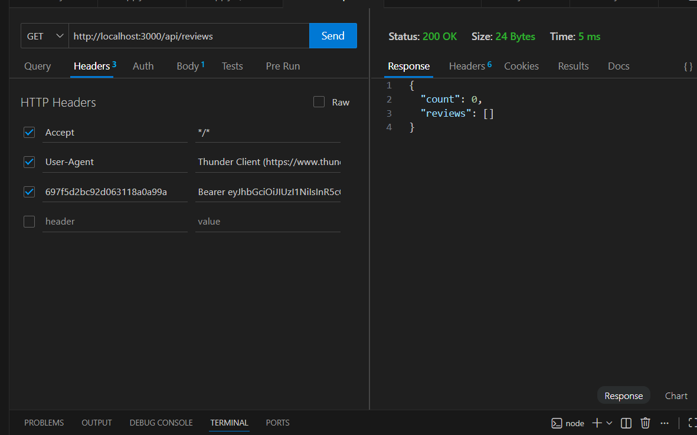
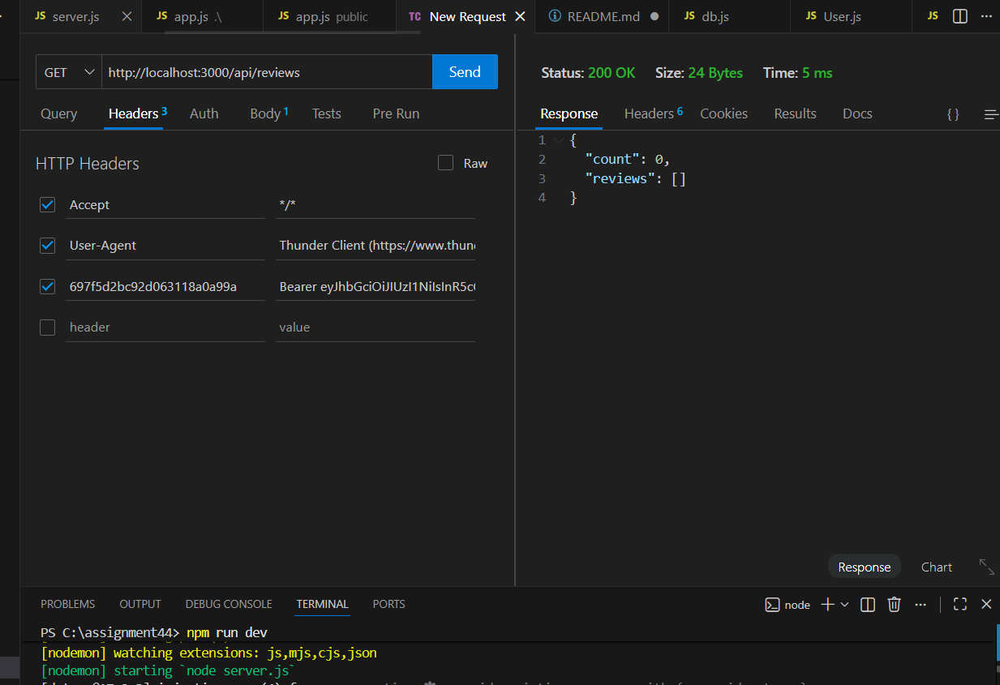
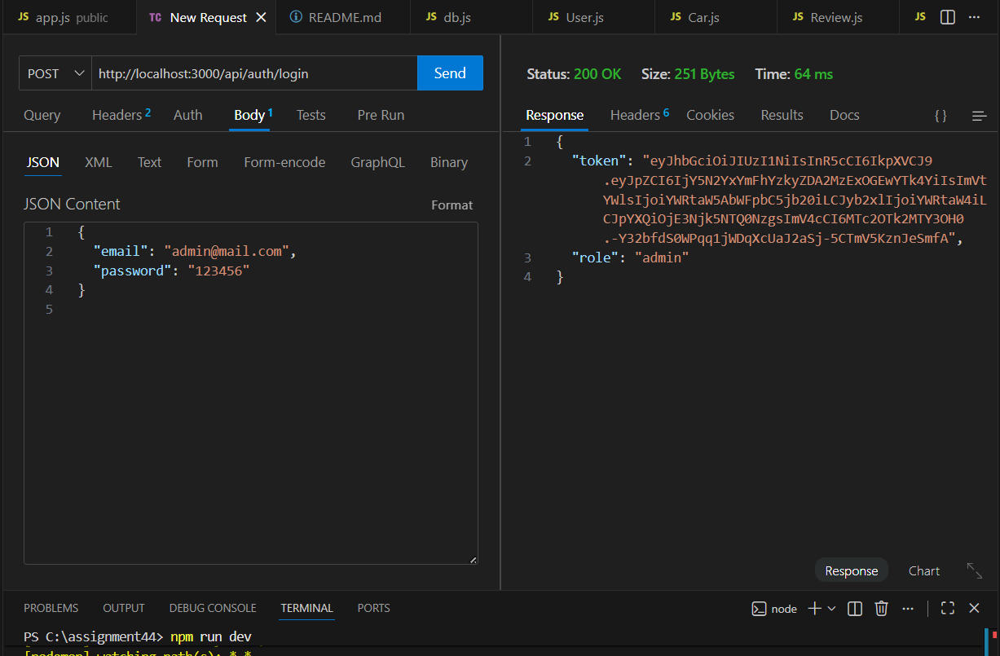
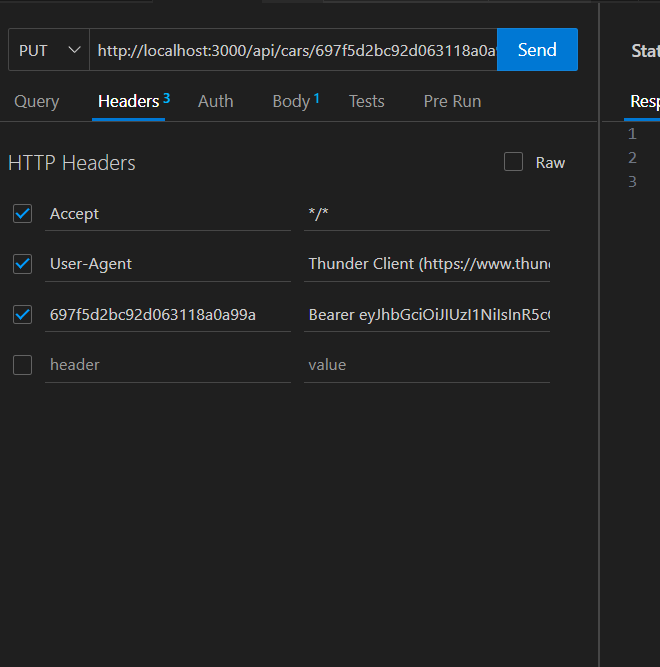
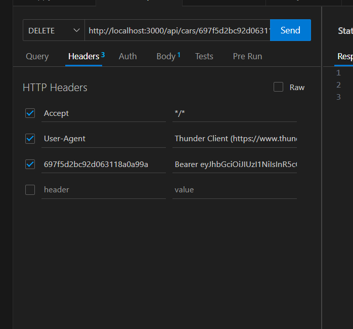
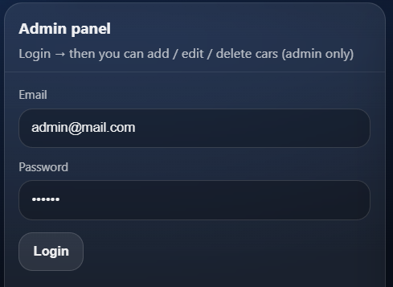

**Topic:** Auto Dealership 

This project implements:
- MVC architecture (Models, Routes, Controllers, Middleware)
- Two related MongoDB objects with full CRUD
- Authentication with bcrypt and JWT
- Role-Based Access Control (Admin vs User)

---

##  Two Related Objects

### Primary Object: Car

**Schema (models/Car.js):**
```javascript
{
  brand: String (required),       // "Toyota"
  model: String (required),       // "Camry"
  year: Number (required),        // 2020
  price: Number (required),       // 13500000 KZT
  mileage: Number,               // 65000 km
  color: String,                 // "White"
  transmission: String,          // "AT" or "MT"
  fuel: String,                  // "Gasoline"
  description: String
}
```

### Secondary Object: Review

**Schema (models/Review.js):**
```javascript
{
  carId: ObjectId (ref: "Car"),  // Foreign key
  rating: Number (1-5),
  comment: String
}
```

**Relationship:** One Car → Many Reviews

**CRUD Operations:** All endpoints support Create, Read, Update, Delete
- GET (Public) - Anyone can view
- POST/PUT/DELETE (Admin only) - Protected by JWT + role check

---

###  MongoDB Screenshots


---


---

## 🏗 MVC Architecture

```
cars-dealership/
├── models/
│   ├── User.js          # email, passwordHash, role
│   ├── Car.js           # Primary object
│   └── Review.js        # Secondary object
│
├── controllers/
│   ├── authController.js    # register, login, makeAdmin
│   ├── carController.js     # Car CRUD
│   └── reviewController.js  # Review CRUD
│
├── routes/
│   ├── authRoutes.js
│   ├── carRoutes.js
│   └── reviewRoutes.js
│
├── middleware/
│   ├── auth.js          # JWT verification
│   ├── isAdmin.js       # Role check
│   └── errorLogger.js
│
├── public/
│   ├── index.html
│   └── app.js
│
├── app.js
├── server.js
└── .env
```

**Why MVC?**
- Separation of concerns
- Easy to maintain
- Scalable architecture
- Industry standard

---

##  Security Implementation

### 1. Password Hashing (bcrypt)

```javascript
// Registration
const passwordHash = await bcrypt.hash(password, 10);
await User.create({ email, passwordHash, role: "user" });

// Login
const isValid = await bcrypt.compare(password, user.passwordHash);
```

### 2. JWT Authorization

```javascript
// Generate token on login
const token = jwt.sign(
  { id: user._id, email: user.email, role: user.role },
  process.env.JWT_SECRET,
  { expiresIn: "2h" }
);

// Verify token (middleware/auth.js)
const payload = jwt.verify(token, process.env.JWT_SECRET);
req.user = payload;
```

### 3. RBAC Implementation

```javascript
// middleware/isAdmin.js
function isAdmin(req, res, next) {
  if (req.user.role !== "admin") {
    return res.status(403).json({ error: "Forbidden" });
  }
  next();
}

// routes/carRoutes.js
router.post("/", auth, isAdmin, carController.create);  // Admin only
router.get("/", carController.getAll);                  // Public
```


---

## 📡 API Endpoints

**Base:** `http://localhost:3000`

### Authentication
- POST `/api/auth/register` - Register user
- POST `/api/auth/login` - Login (returns JWT)
- POST `/api/auth/make-admin` - Promote to admin

### Cars
- GET `/api/cars` - Get all (Public)
- GET `/api/cars/:id` - Get one (Public)
- POST `/api/cars` - Create (Admin)
- PUT `/api/cars/:id` - Update (Admin)
- DELETE `/api/cars/:id` - Delete (Admin)

### Reviews
- GET `/api/reviews` - Get all (Public)
- GET `/api/reviews/:id` - Get one (Public)
- POST `/api/reviews` - Create (Admin)
- PUT `/api/reviews/:id` - Update (Admin)
- DELETE `/api/reviews/:id` - Delete (Admin)

---

##  Setup

### Installation

1. Install dependencies:
```bash
npm install
```

2. Create `.env`:
```env
PORT=3000
MONGO_URI=mongodb://127.0.0.1:27017
DB_NAME=wt2_assignment4_autodealer
JWT_SECRET=your_secret_key
```

3. Run:
```bash
npm run dev
```

4. Access:
- API: http://localhost:3000/api
- Frontend: http://localhost:3000/

---

##  Postman Testing

### Setup Users

1. Register regular user:
```
POST /api/auth/register
{ "email": "user@test.com", "password": "user123" }
```

2. Register admin:
```
POST /api/auth/register
{ "email": "admin@test.com", "password": "admin123" }
```

3. Promote to admin:
```
POST /api/auth/make-admin
{ "email": "admin@test.com" }
```

4. Login as user (save token as USER_TOKEN):
```
POST /api/auth/login
{ "email": "user@test.com", "password": "user123" }
```

5. Login as admin (save token as ADMIN_TOKEN):
```
POST /api/auth/login
{ "email": "admin@test.com", "password": "admin123" }
```

---

##  Postman Test Cases

### Test 1: User tries POST (403 Forbidden)

```
POST /api/cars
Headers: Authorization: Bearer USER_TOKEN
Body: { "brand": "BMW", "model": "X5", "year": 2022, "price": 25000000 }

Expected: 403 Forbidden
```

---

###  Test 2: No token (401 Unauthorized)

```
POST /api/cars
Body: { "brand": "Audi", "model": "A4", "year": 2021, "price": 18000000 }

Expected: 401 Unauthorized
```

[INSERT SCREENSHOT: Postman showing 401 error]

---

###  Test 3: Admin POST (201 Created)

```
POST /api/cars
Headers: Authorization: Bearer ADMIN_TOKEN
Body: { "brand": "Toyota", "model": "Camry", "year": 2020, "price": 13500000 }

Expected: 201 Created
```


---

###  Test 4: Admin PUT (200 OK)

```
PUT /api/cars/:id
Headers: Authorization: Bearer ADMIN_TOKEN
Body: { "price": 13000000 }

Expected: 200 OK
```


---

###  Test 5: Admin DELETE (200 OK)

```
DELETE /api/cars/:id
Headers: Authorization: Bearer ADMIN_TOKEN

Expected: 200 OK
```


---


##  Testing Summary

###  Success (Admin):
- POST /api/cars → 201
- PUT /api/cars/:id → 200
- DELETE /api/cars/:id → 200
- POST /api/reviews → 201
- Passwords hashed in DB
- JWT generated on login

###  Failures (Security):
- User POST → 403 Forbidden
- No token POST → 401 Unauthorized
- Invalid carId → 400 Bad Request

###  Public Access:
- GET /api/cars works without auth
- GET /api/reviews works without auth

---


### Architecture & CRUD (25%)
-  Models, Routes, Controllers, Middleware separated
-  Car full CRUD
-  Review full CRUD
-  One-to-many relationship

### Security & RBAC (25%)
-  bcrypt password hashing
-  JWT authentication
-  Admin restricts POST/PUT/DELETE
-  Token verification middleware




---

##  Dependencies

```json
{
  "express": "^4.18.2",
  "mongoose": "^7.0.0",
  "bcrypt": "^5.1.0",
  "jsonwebtoken": "^9.0.0",
  "dotenv": "^16.0.3"
}
```

---

##  Author

**Name:** [Your Name]  
**Student ID:** [Your ID]  
**Course:** Web Technologies 2  
**Assignment:** #4

**GitHub:** [Repository link]  
**Postman:** [Collection link]

---

##  Conclusion

Successfully implemented:
- MVC architecture with clean separation
- Secure authentication (bcrypt + JWT)
- Role-based access control
- Two related objects with full CRUD
- Professional industry practices
